# IGFSS - Intergenerational Family Support System

IGFSS is a full-stack community platform that connects Senior Mentors with Young Households through participant registration, member authentication, directory search, and community gathering management.

Designed and implemented independently using embedded Jetty, Jersey REST services, JDBC, MySQL, and framework-free JavaScript.

## Tech Stack

**Backend:** Java 17 · Jetty 11 (embedded) · Jersey 3.1 (JAX-RS) · Jackson · MySQL 8 · JDBC · Maven

**Client:** HTML · CSS · JavaScript 

## Core Features

- Registers Senior Mentors and Young Households using role-specific forms and server-side validation
- Authenticates members and temporarily locks accounts after repeated failed sign-in attempts
- Creates, retrieves, and browses community gatherings
- Provides a searchable participant directory using Family Identification Numbers (FIDN)
- Automatically initialises the database schema and development seed data on first startup

## Security

- **Development HTTPS** - on first startup, `SslContextProvisioner` generates a local RSA-2048 self-signed certificate using the JDK `keytool`. HTTP requests on port 8080 are redirected to HTTPS on port 8443. Production deployment would use a certificate from a trusted certificate authority.
- **Brute-force protection** - a thread-safe, in-memory attempt ledger tracks failed sign-ins per email address and applies a temporary lockout after three failures within a rolling 15-minute window.
- **SQL injection prevention** - all database operations that accept external input use parameterised `PreparedStatement` queries. User input is never concatenated into SQL statements.

## Architecture

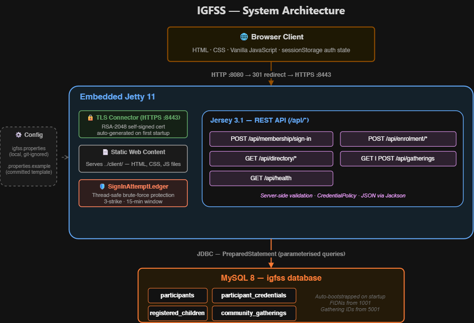

## API Endpoints

| Method | Endpoint | Purpose |
|--------|----------|---------|
| `POST` | `/api/membership/sign-in` | Authenticate a registered participant |
| `POST` | `/api/enrolment/senior-mentor` | Register a Senior Mentor |
| `POST` | `/api/enrolment/young-household` | Register a Young Household |
| `GET` | `/api/directory/fidns` | List all participant FIDNs |
| `GET` | `/api/directory/{fidn}` | Retrieve participant details by FIDN |
| `POST` | `/api/gatherings` | Create a community gathering |
| `GET` | `/api/gatherings` | List all gatherings |
| `GET` | `/api/health` | Service health and database status |

All endpoints return a uniform `ApiResponse` envelope: `{ accepted, replyMessage, replyData }`.

## Why Embedded Jetty

I selected embedded Jetty to gain direct experience configuring the server lifecycle, TLS connector, HTTP-to-HTTPS redirection, and Jersey servlet integration at the socket level. A framework such as Spring Boot would reduce much of this infrastructure code through conventions and auto-configuration - for this project, implementing these components explicitly was a deliberate choice.

## Screenshots

### Welcome Page
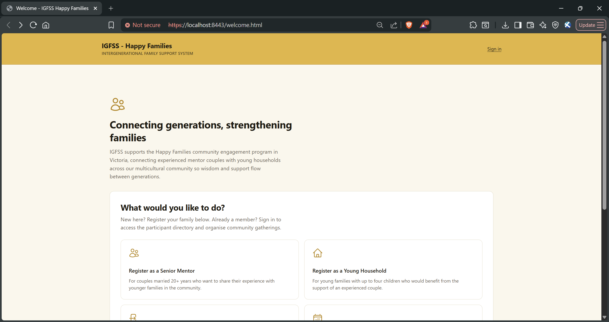

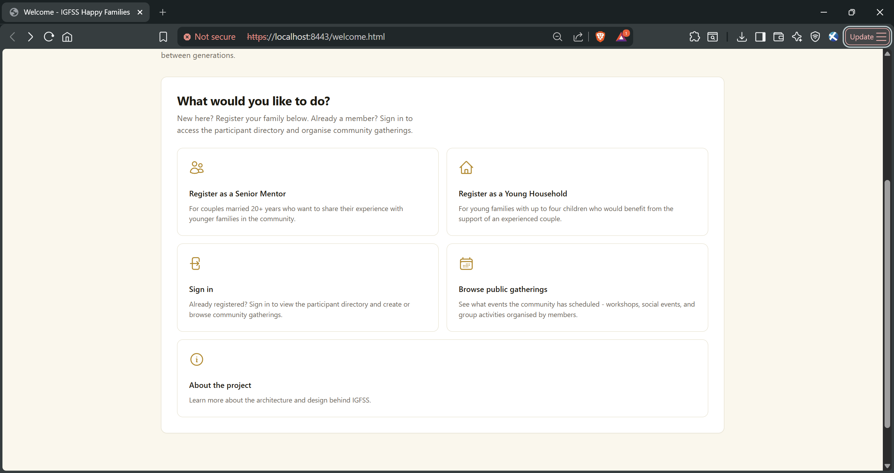

---

### Senior Mentor Registration
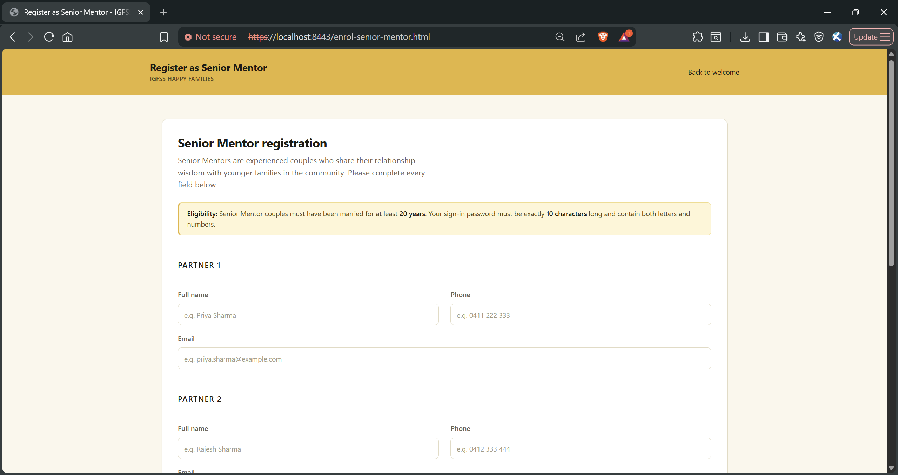

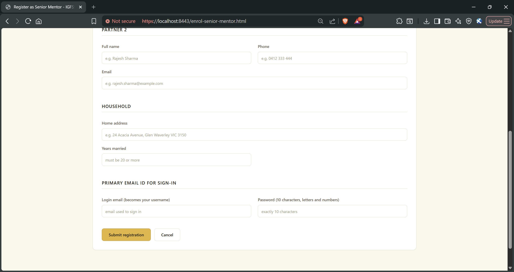

---

### Young Household Registration
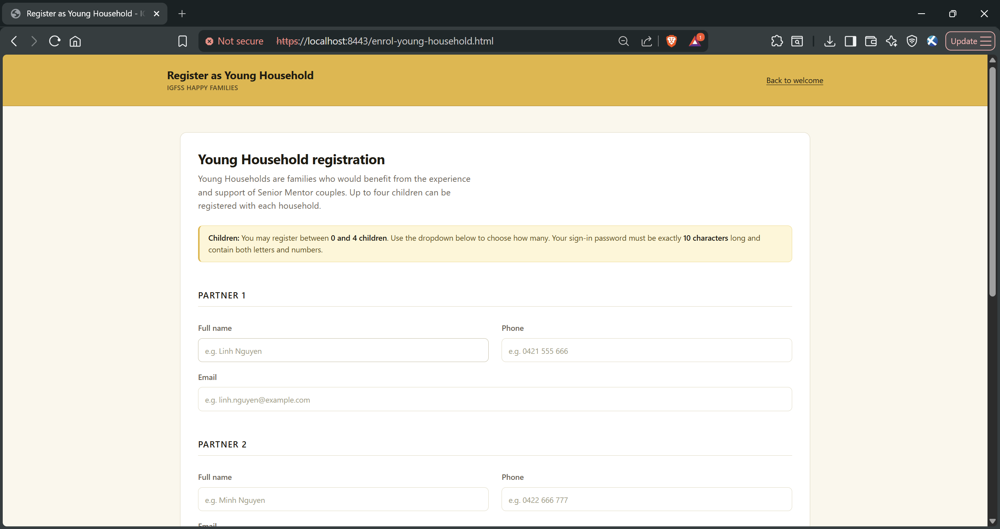

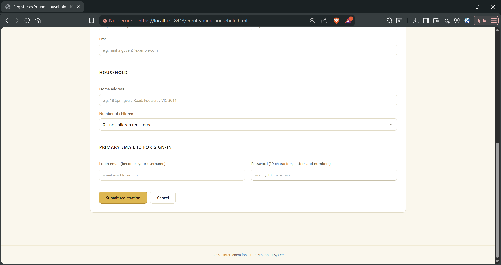

---

### Sign-in & Brute-Force Protection
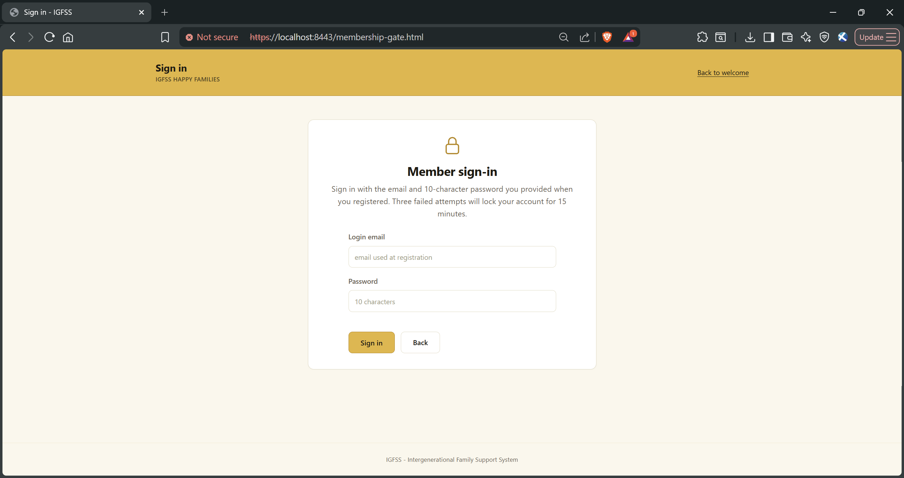

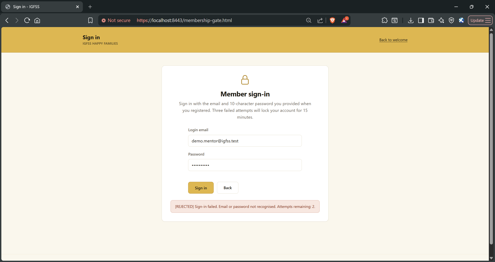

---

### Member Dashboard
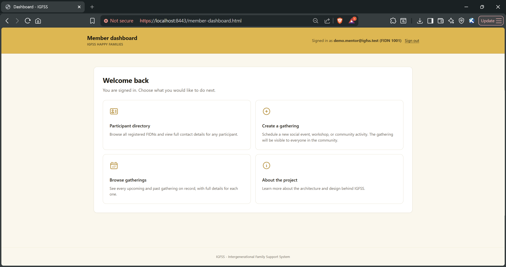

---

### Participant Directory
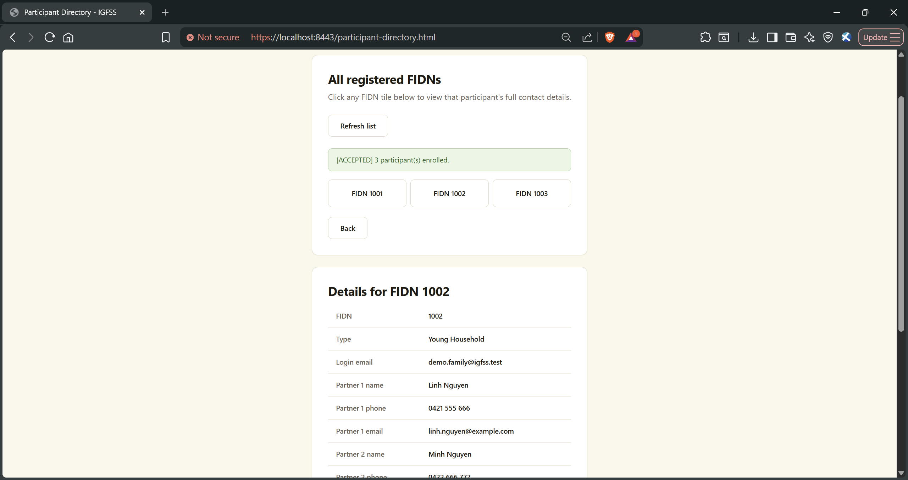

---

### Community Gatherings
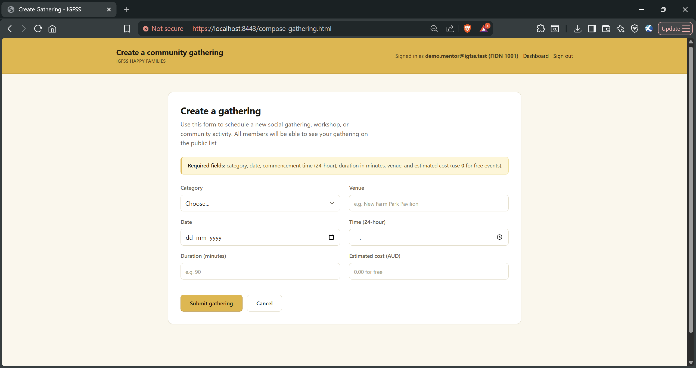

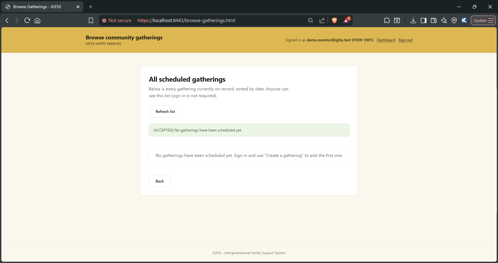

---

### Server Startup
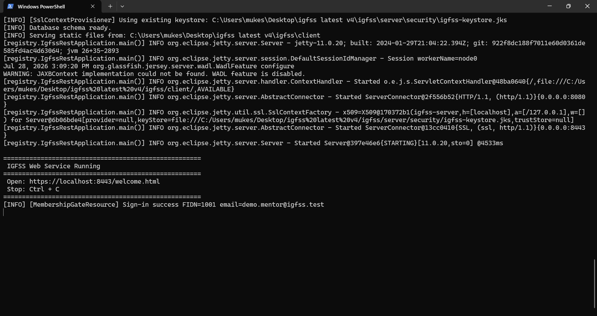

---

## Running Locally

### Prerequisites

- JDK 17 or later
- Maven 3.9+
- MySQL 8
- A MySQL user with database creation privileges

### Setup

```bash
# 1. Configure
cp server/igfss.properties.example server/igfss.properties
# Edit: set mysql.password and keystore.password

# 2. Build and run
cd server
mvn package
mvn exec:java -Dexec.mainClass=registry.IgfssRestApplication

# 3. Open https://localhost:8443/welcome.html
```

The server creates the database schema and seeds demo accounts on first startup. The real configuration file is excluded from version control via `.gitignore`.

**Demo accounts:**

| Role | Email | Password |
|------|-------|----------|
| Senior Mentor | demo.mentor@igfss.test | Mentor10AB |
| Young Household | demo.family@igfss.test | Family10AB |

## Related Project

IGFSS complements my [Disaster Response System](https://github.com/mukeshkrish08/disaster-response-system), a JavaFX desktop application that communicates with a multithreaded Java server using raw TCP sockets.

Together, the two projects demonstrate different client–server architectures: RESTful HTTP services with a browser client versus stateful TCP socket communication with a desktop client.

## Production Improvements

- Hash passwords using BCrypt or Argon2id instead of plaintext storage
- Replace browser-managed authentication state with secure, HttpOnly session cookies
- Introduce HikariCP connection pooling to replace the development-oriented single connection
- Return endpoint-specific HTTP status codes (400, 401, 404) instead of the uniform 200 envelope
- Add rate limiting by both account identifier and source IP address

## Author

**Mukesh Varman** - [GitHub](https://github.com/mukeshkrish08) · [LinkedIn](https://linkedin.com/in/mukeshvarman)
